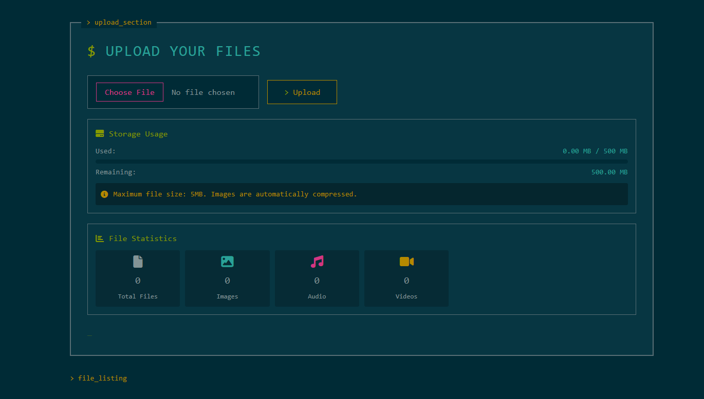

# 📁 File Uploader Django Web App

A simple and lightweight Django-based file uploader that allows users to upload, view, and manage files online with real-time storage usage tracking.

---

## 👨‍💻 About This Project

- 🌱 Built using Django with a clean and minimal UI
- 📤 Users can upload files (images, videos, audio, documents)  
- 📊 Displays storage usage (used / remaining)
- 🚀 Designed for learning **file uploads, media handling, and deployment on PythonAnywhere**
- 🚀 Deployed live on PythonAnywhere.

---

## 🖼 Demo Preview

<br>

---

## 🚀 Features

* Upload multiple file types (images, audio, video, documents)
* Automatic image compression (max size: 5MB) date.  
* View uploaded files directly from the browser
* Storage usage indicator
* Admin-ready Django backend

---

## 📂 Folder Structure
```File-Uploader-v1.0/
│
├── myapp/
│ ├── migrations/
│ ├── templates/
│ ├── static/
│ ├── admin.py
│ ├── apps.py
│ ├── models.py
│ ├── views.py
│ └── urls.py
│
├── fileuploader/
│ ├── settings.py
│ ├── urls.py
│ ├── wsgi.py
│ └── asgi.py
│
├── media/
├── db.sqlite3
├── manage.py
├── requirements.txt
└── README.md

```

---

## 🛠 Technologies Used


---

## ⚡ Installation & Setup

1. **Clone the repository**

```bash
git clone https://github.com/dineshsinghdhami/File-Uploader-v1.0.git
cd File-Uploader-v1.0

```

---


2. Create a virtual environment
   
```bash
python -m venv venv
source venv/bin/activate   # Linux/Mac
venv\Scripts\activate      # Windows

```

---

3. Install dependencies

```bash
pip install -r requirements.txt

```

---


4. Apply migrations

```bash
python manage.py migrate

```

---

5. Run the development server

```bash
python manage.py runserver

Open http://127.0.0.1:8000 in your browser.

```

---

6. 🔑 Admin Panel

```bash

Create a superuser

python manage.py createsuperuser

```

7. Access admin panel
   
```bash
http://127.0.0.1:8000/admin

```

---

---


## 🌟 Connect with Me

Feel free to reach out via email or LinkedIn for collaboration or feedback!
* **Phone:** +977-9866109958
* **Email:** [dineshdhamidn@gmail.com](mailto:dineshdhamidn@gmail.com)
* **Twitter:** [https://x.com/dineshdhami001](https://x.com/dineshdhami001)
* **GitHub:** [github.com/dineshsinghdhami](https://github.com/dineshsinghdhami)
* **LinkedIn:** [linkedin.com/in/dineshsinghdhami1](https://linkedin.com/in/dineshsinghdhami1)


---

### 🧑‍💼 Project Owner  
- **Dinesh Singh Dhami ❤️**  
